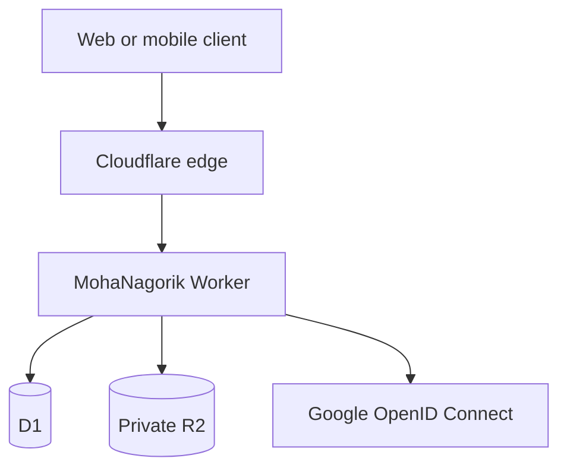

# Production deployment

## Recommended topology

The edge is responsible for HTTPS, certificate renewal, reverse proxying, caching of static assets, DDoS filtering, request routing, and horizontally distributing Worker execution. The application remains stateless; persistent data lives in D1 and R2.

## The four scaling concerns

| Concern | Current production decision | Add another product when |
|---|---|---|
| Security and performance | Enforce authorization, CSRF/origin checks, input limits, safe uploads, headers, indexes, CI, logs, backups, and secret rotation | Continuously; this is application work, not one appliance |
| Reverse proxy | Cloudflare edge | Only after moving to self-hosted containers/VMs; use Caddy or Nginx there |
| API gateway | Cloudflare routing, WAF/rate rules, and the optional Worker rate-limit binding | Add API Shield or a dedicated gateway when a versioned external/mobile API, API keys, quotas, or multiple backend services exist |
| Load balancer | Cloudflare's globally distributed Worker runtime | Add Cloudflare Load Balancing only when routing across multiple independent origins or regions |

## Before the first public launch

1. Rotate the exposed Google client secret and create separate development, staging, and production OAuth clients.
2. Set `APP_ORIGIN` and encrypted OAuth/session secrets in the deployment control plane.
3. Bind a production D1 database, a private R2 bucket, and a Worker rate limiter.
4. Apply every SQL migration in `drizzle/` exactly once and verify the indexes exist.
5. Configure the Google OAuth consent screen, privacy policy, terms, verified domain, and exact callback URI.
6. Protect `main`, require the CI workflow, and deploy from reviewed commits.
7. Enable Cloudflare WAF managed rules, bot protection appropriate to the plan, and stricter path rules for `/api/auth/*` and upload routes.
8. Configure logs, error alerts, uptime monitoring against `/api/health`, D1 recovery/export procedures, and an R2 lifecycle policy.
9. Test account isolation with two unrelated households and verify one household cannot read IDs, receipts, avatars, expenses, or settlements from another.
10. Run load tests against staging, not production. Measure p50/p95/p99 latency, error rate, D1 query counts, and upload throughput.

## Rate limiting

The application uses `RATE_LIMITER` when that binding is available and safely continues without it for local development. Production should configure it with a per-location allowance suitable for interactive use, then add stricter Cloudflare rules for OAuth starts, household joins, and uploads. Rate limits are a safety control, not an authorization mechanism.

## Web and mobile API evolution

The current API is a first-party, same-origin web API authenticated by a browser cookie. A native mobile app should not embed the Google client secret or reuse this browser session design.

Before releasing mobile clients:

- introduce `/api/v1/*` resource-oriented endpoints with a published OpenAPI contract;
- use Authorization Code + PKCE with a mobile redirect scheme and short-lived access tokens;
- add refresh-token rotation, token revocation, device/session management, idempotency keys, and API versioning;
- configure explicit CORS allowlists only for legitimate web origins;
- retain the same server-side household authorization on every resource.

Do not split the application into microservices merely for anticipated traffic. Keep the modular monolith until independent teams, scaling profiles, or failure domains justify separation.

## Operational targets

- Availability target: start with 99.9% and measure it.
- API latency target: p95 below 500 ms for ordinary reads and writes under expected regional load.
- Recovery: document RPO/RTO, test database recovery quarterly, and verify R2 retention.
- Deployments: staging first, automated migrations, health verification, gradual rollout where supported, and a tested rollback procedure.
